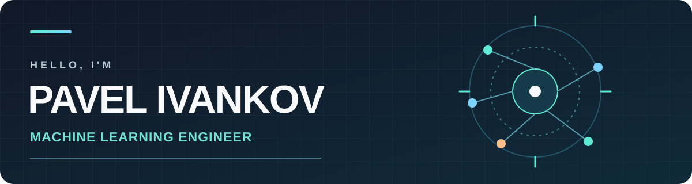

  

<h1 align="center">Hi, I'm Pavel 👋</h1>

  <strong>Machine Learning Engineer at Alfa-Bank</strong> 
  Multimodal ML · Computer Vision · NLP

  <a href="#selected-work">Selected work</a> ·
  <a href="#toolbox">Toolbox</a> ·
  <a href="https://github.com/PaVeLlLlLX?tab=repositories">All repositories</a>

I build ML systems that connect research ideas with usable software: from data and model training to inference and deployment. Lately, I've been working on multimodal product understanding and tools for AI-assisted development.

## Selected work

### [Ozon E-CUP 2026 · Product card quality](https://github.com/PaVeLlLlLX/ozon-tech-ecup-2026)

A multimodal solution that checks whether a product belongs to its stated category using its title, description, and photos. Built around a Qwen3-VL model with LoRA adapters and category-specific decision rules.

`multimodal ML` · `vision-language models` · `LoRA` · `Python`

### [Agent Panel · Claude Code + Codex in VS Code](https://github.com/PaVeLlLlLX/agent-panel)

A VS Code extension that brings two coding agents into one conversation. It includes a review loop, permission requests, session recovery, and a local activity log.

`VS Code extension` · `JavaScript` · `developer tools`

### [Ozon Tech E-CUP 2025 · Counterfeit detection](https://github.com/PaVeLlLlLX/Ozon-Tech-E-Cup-bebryata)

An end-to-end classification pipeline that combines tabular data, product text, and images to detect counterfeit goods. Packaged with Docker for reproducible inference.

`multimodal ML` · `classification` · `Docker`

### [AI Comics Converter · TE AI Hack](https://github.com/PaVeLlLlLX/TE-AI-Hack-bebryata)

A hackathon prototype that turns long documents and scans into comics. Specialized agents handle OCR, scene planning, image generation, and page assembly.

`multi-agent systems` · `OCR` · `Streamlit` · `Python`

More ML work: [predicting future transaction categories with an FT-Transformer](https://github.com/PaVeLlLlLX/alfa-predict-next-transactions).

## Toolbox

| Area | Tools |
| --- | --- |
| ML & data | Python · PyTorch · Hugging Face · scikit-learn · pandas · OpenCV |
| Applications | FastAPI · Streamlit · JavaScript |
| Delivery | Docker · Git · Linux · MLflow · PostgreSQL |

  

