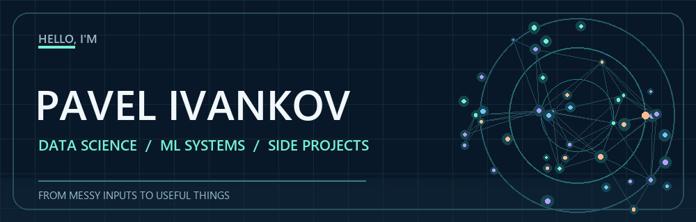
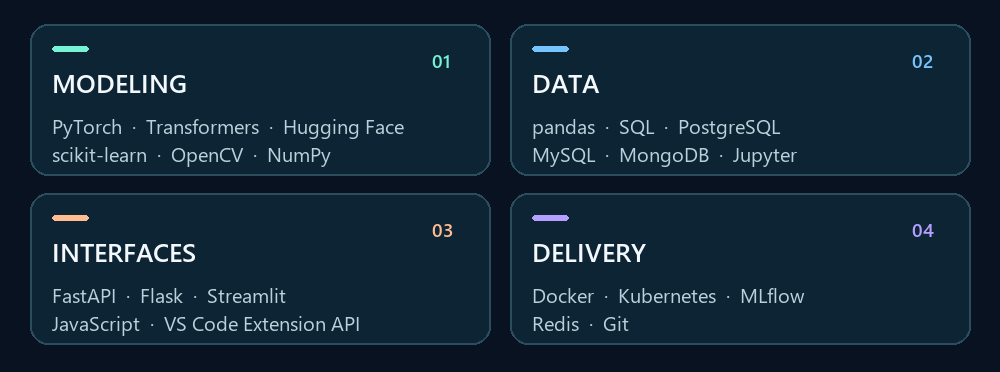
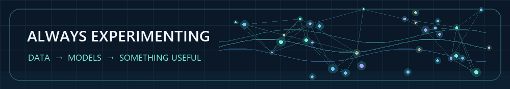

  <picture>
    <source media="(prefers-reduced-motion: reduce)" srcset="assets/hero.png" />
    
  </picture>

  <strong>Data scientist who likes building the whole thing.</strong> 
  I enjoy the space between exploring messy data, training a model, and making something people can actually use.

  <a href="#things-ive-built">Things I've built</a> &nbsp;·&nbsp;
  <a href="#toolbox">Toolbox</a> &nbsp;·&nbsp;
  <a href="https://github.com/PaVeLlLlLX?tab=repositories">All repositories ↗</a>

## Things I've built

A few public experiments, each a different kind of puzzle:

- **[Agent Panel](https://github.com/PaVeLlLlLX/agent-panel)** — one VS Code space for Claude Code and Codex, with a review loop and local history.
- **[Ozon E-CUP 2026](https://github.com/PaVeLlLlLX/ozon-tech-ecup-2026)** — a vision-language approach to checking product cards against their categories.
- **[AI Comics Converter](https://github.com/PaVeLlLlLX/TE-AI-Hack-bebryata)** — a multi-agent prototype that turns dense documents into comics.

Also: [multimodal counterfeit detection](https://github.com/PaVeLlLlLX/Ozon-Tech-E-Cup-bebryata) · [transaction category prediction](https://github.com/PaVeLlLlLX/alfa-predict-next-transactions).

## Toolbox

  

  <picture>
    <source media="(prefers-reduced-motion: reduce)" srcset="assets/signal.png" />
    
  </picture>

